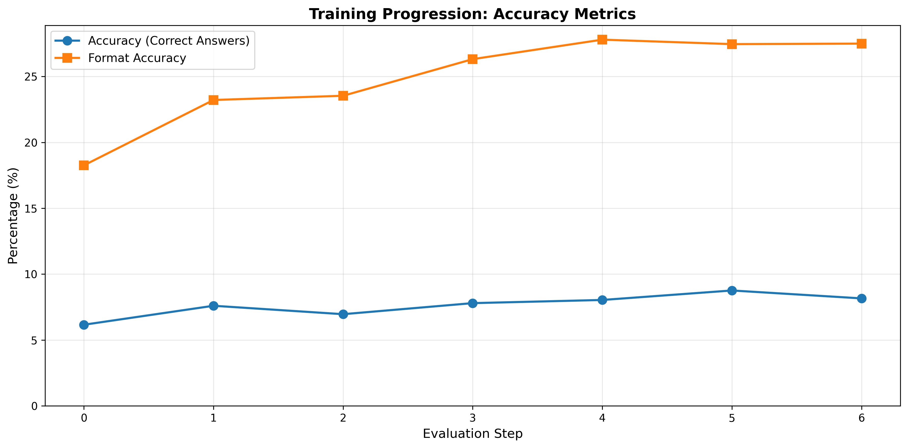
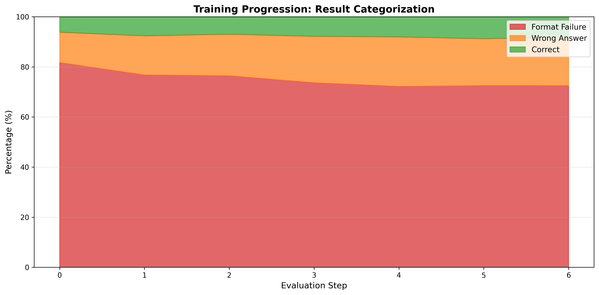
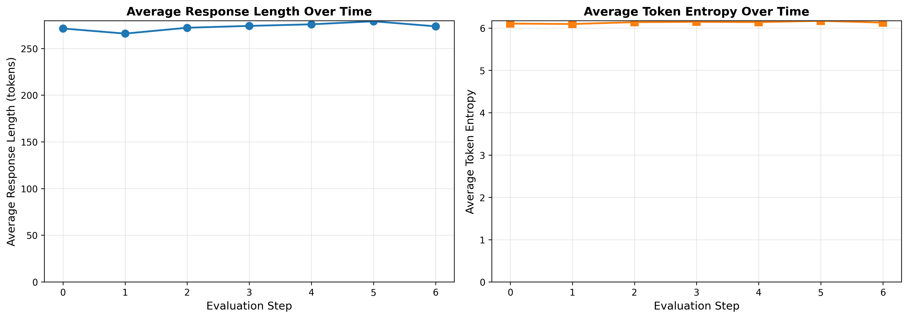
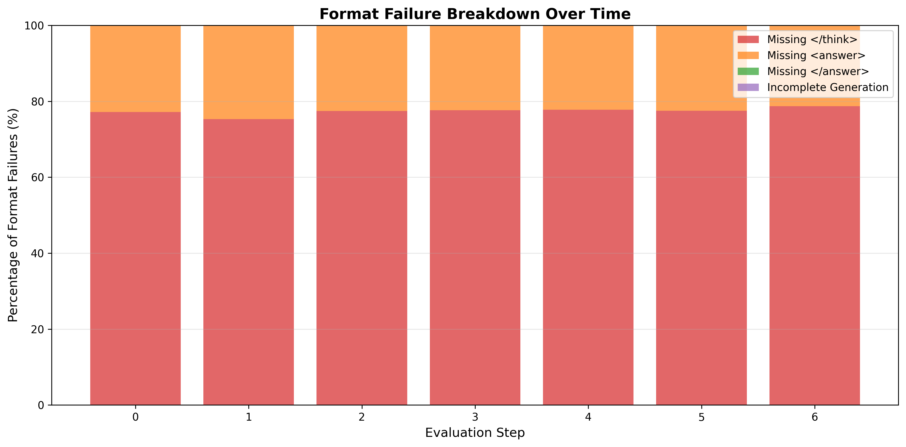

# Supervised Fine-Tuning (SFT) - MATH Dataset

Supervised fine-tuning of Qwen 2.5 Math 1.5B on MATH dataset using dual-GPU architecture for continuous training and evaluation.

**Based on**: [Stanford CS336 Assignment 5: Alignment](https://github.com/stanford-cs336/assignment5-alignment)

## Quick Start

```bash
# Install dependencies
uv sync --extra vllm  # Linux/WSL only (vLLM not supported on Windows)

# Run dual-GPU SFT training
python step1_sft.py
```

## Architecture

```
GPU 0 (Training)          Queue          GPU 1 (Evaluation)
─────────────────────────────────────────────────────────
Training Loop      ────────────▶      vLLM Instance
  ↓                                      ↓
Checkpoint Save    ─ push path ──▶    Load Checkpoint
  ↓                (non-blocking)      ↓
Continue                               Run Validation
                                        ↓
                                      Log Metrics
                                        ↓
                                    Save Results
```

### Key Features

- **Dual-GPU Pipeline**: Training on GPU 0, continuous evaluation on GPU 1
- **Non-blocking Evaluation**: Training never waits for evaluation
- **Full Dataset Training**: Trains on complete MATH training set (~7,500 examples)
- **Full Dataset Evaluation**: Evaluates on complete MATH test set (~5,000 examples)
- **Comprehensive Logging**: Detailed logs with prompt, problem, solution, response, and metrics
- **W&B Integration**: Real-time metrics tracking with separate runs for training and evaluation

## Configuration

Edit `config/sft_config.yaml` to customize training:

```yaml
training:
  learning_rate: 2.0e-5        # Standard SFT learning rate
  batch_size: 40               # Adjusted based on GPU memory
  gradient_accumulation_steps: 2  # Effective batch = 80
  warmup_steps: 100            # 10-20% of total steps
  eval_every: 1000             # Evaluate every N training steps
  device: "cuda:0"

evaluation:
  device: "cuda:1"
  num_eval_samples: 10000      # Full test dataset
  batch_size: 256              # Large batch for fast eval
```

## Training Dataset

**Dataset**: MATH (Hendrycks et al.)  
**Training Examples**: ~7,500 across 7 subsets  
**Test Examples**: ~5,000 across 7 subsets  
**Prompt Format**: RL zero (`<think>` reasoning + `<answer>` tags)

### Subsets
- Algebra
- Counting and Probability
- Geometry
- Intermediate Algebra
- Number Theory
- Prealgebra
- Precalculus

## Evaluation Results Structure

Results are saved in `results/eval_logs/` and `results/analysis/`:

```
results/
├── eval_logs/
│   ├── eval_step_0_TIMESTAMP.jsonl      # Detailed per-example logs
│   ├── eval_step_1_TIMESTAMP.jsonl
│   ├── summary_eval_step_0_TIMESTAMP.json
│   └── summary_eval_step_1_TIMESTAMP.json
└── analysis/
    ├── summary_step_0.json              # Categorized analysis
    ├── summary_step_1.json
    ├── categories_step_0.json           # Example categorizations
    └── categories_step_1.json
```

### Log File Format (eval_step_N.jsonl)

Each line contains a JSON object with:
```json
{
  "prompt": "Full formatted prompt...",
  "problem": "Original problem text",
  "response": "Generated response...",
  "ground_truth": "Ground truth solution",
  "solution": "Ground truth solution",
  "rewards": {
    "format_reward": 1.0,
    "answer_reward": 1.0,
    "total_reward": 1.0
  },
  "metrics": {
    "token_entropy": 5.23,
    "response_length": 143
  }
}
```

### Summary File Format

```json
{
  "eval_step": 0,
  "total_examples": 5000,
  "categorization": {
    "correct": {"count": 142, "percentage": 2.84},
    "wrong_answer": {"count": 657, "percentage": 13.14},
    "format_failure": {"count": 4201, "percentage": 84.02}
  },
  "metrics": {
    "accuracy": 0.0284,
    "format_accuracy": 0.1598,
    "avg_response_length": 143.9,
    "avg_token_entropy": 5.237
  }
}
```

## Weights & Biases (W&B) Tracking

### Accessing Training and Evaluation Logs

The training pipeline automatically logs metrics to Weights & Biases with separate runs:

#### Training Metrics (GPU 0)
- **Run Name**: `math-sft-dual-gpu-{timestamp}`
- **Project**: `math-sft` (configurable in `config/sft_config.yaml`)
- **Metrics Tracked**:
  - `train/loss` - Training loss per batch
  - `train/learning_rate` - Learning rate schedule
  - `train_step` - Training step number
  - `train_gpu/memory_used` - GPU memory usage
  - `train_gpu/utilization` - GPU utilization

#### Evaluation Metrics (GPU 1)
- **Run Name**: `eval-worker-{id}`
- **Project**: `math-sft` (same project, separate run)
- **Group**: `dual-gpu-training`
- **Metrics Tracked**:
  - `eval/accuracy` - Overall accuracy (correct answers)
  - `eval/format_accuracy` - Format compliance accuracy
  - `eval/num_correct` - Number of correct answers
  - `eval/num_format_correct` - Number of correctly formatted responses
  - `eval/avg_response_length` - Average response length in tokens
  - `eval/avg_response_length_correct` - Avg length for correct answers
  - `eval/avg_response_length_incorrect` - Avg length for incorrect answers
  - `eval/avg_token_entropy` - Average token entropy
  - `eval_step` - Evaluation checkpoint number
  - `eval_gpu/memory_used` - GPU memory usage
  - `eval_gpu/utilization` - GPU utilization

### Finding Your W&B Links

After starting training, the console will display:
```
✓ W&B initialized: math-sft-dual-gpu-20251224_123456
```

**Access your runs:**
1. **W&B Dashboard**: https://wandb.ai
2. **Project URL**: `https://wandb.ai/{entity}/math-sft` (replace `{entity}` with your W&B username/team)
3. **Direct Run Links**: Printed to console when training starts

**Example W&B URLs:**
- Training run: `https://wandb.ai/{entity}/math-sft/runs/math-sft-dual-gpu-{timestamp}`
- Evaluation run: `https://wandb.ai/{entity}/math-sft/runs/eval-worker-{id}`

### Viewing Metrics

In the W&B dashboard, you can:
- Compare training and evaluation runs side-by-side
- Track accuracy progression over evaluation steps
- Monitor GPU utilization and memory usage
- Export metrics as CSV or JSON
- Create custom plots and panels

### Configuration

To customize W&B settings, edit `config/sft_config.yaml`:
```yaml
logging:
  wandb_project: "math-sft"     # Change project name
  wandb_entity: null            # Set to your W&B username/team (or leave null for default)
  log_every: 1                  # Log frequency (1 = every batch)
```

## Plotting Training Progression

### Generated Plots

Training progression plots are automatically generated in the `results/` directory:


*Training progression: Accuracy and Format Accuracy metrics over evaluation steps*


*Training progression: Result categorization (Correct, Wrong Answer, Format Failure) stacked over time*


*Training progression: Response length and token entropy over evaluation steps*


*Training progression: Breakdown of format failure types over evaluation steps*

### Automated Plotting Script

To regenerate plots from evaluation results, use:

```python
"""Plot training progression from evaluation results."""
import json
import matplotlib.pyplot as plt
import numpy as np
from pathlib import Path
import glob
import re

def load_eval_results(results_dir="results/eval_logs"):
    """Load all evaluation summaries."""
    summaries = {}
    for summary_file in sorted(glob.glob(f"{results_dir}/summary_eval_step_*.json")):
        match = re.search(r"eval_step_(\d+)_", summary_file)
        if match:
            step = int(match.group(1))
            with open(summary_file) as f:
                summaries[step] = json.load(f)
    
    # Also load analysis summaries if available
    analysis_summaries = {}
    for analysis_file in sorted(glob.glob("results/analysis/summary_step_*.json")):
        match = re.search(r"summary_step_(\d+)\.json", analysis_file)
        if match:
            step = int(match.group(1))
            with open(analysis_file) as f:
                analysis_summaries[step] = json.load(f)
    
    return summaries, analysis_summaries

def plot_accuracy_progression(summaries, output_file="results/training_progression_accuracy.png"):
    """Plot accuracy metrics over training steps."""
    steps = sorted(summaries.keys())
    
    if not steps:
        print("No evaluation results found!")
        return
    
    accuracy = [summaries[s].get('num_correct', 0) / summaries[s].get('num_test_cases', 1) * 100 
                for s in steps]
    format_accuracy = []
    
    # Try to get format accuracy from analysis summaries
    for s in steps:
        # Check if we have analysis data
        analysis_file = f"results/analysis/summary_step_{s}.json"
        if Path(analysis_file).exists():
            with open(analysis_file) as f:
                analysis = json.load(f)
                format_accuracy.append(analysis['metrics'].get('format_accuracy', 0) * 100)
        else:
            format_accuracy.append(0)
    
    fig, ax = plt.subplots(figsize=(12, 6))
    ax.plot(steps, accuracy, 'o-', label='Accuracy (Correct Answers)', linewidth=2, markersize=8)
    ax.plot(steps, format_accuracy, 's-', label='Format Accuracy', linewidth=2, markersize=8)
    
    ax.set_xlabel('Evaluation Step', fontsize=12)
    ax.set_ylabel('Percentage (%)', fontsize=12)
    ax.set_title('Training Progression: Accuracy Metrics', fontsize=14, fontweight='bold')
    ax.legend(fontsize=11)
    ax.grid(True, alpha=0.3)
    ax.set_ylim(bottom=0)
    
    plt.tight_layout()
    plt.savefig(output_file, dpi=300, bbox_inches='tight')
    print(f"✓ Saved accuracy plot: {output_file}")
    plt.close()

def plot_categorization_progression(summaries, output_file="results/training_progression_categorization.png"):
    """Plot category breakdown over training steps."""
    steps = sorted(summaries.keys())
    
    if not steps:
        return
    
    correct = []
    wrong_answer = []
    format_failure = []
    
    for s in steps:
        analysis_file = f"results/analysis/summary_step_{s}.json"
        if Path(analysis_file).exists():
            with open(analysis_file) as f:
                analysis = json.load(f)
                cat = analysis['categorization']
                correct.append(cat['correct']['percentage'])
                wrong_answer.append(cat['wrong_answer']['percentage'])
                format_failure.append(cat['format_failure']['percentage'])
        else:
            correct.append(0)
            wrong_answer.append(0)
            format_failure.append(0)
    
    fig, ax = plt.subplots(figsize=(12, 6))
    
    x = np.array(steps)
    ax.fill_between(x, 0, format_failure, label='Format Failure', alpha=0.7, color='#d62728')
    ax.fill_between(x, format_failure, 
                    np.array(format_failure) + np.array(wrong_answer), 
                    label='Wrong Answer', alpha=0.7, color='#ff7f0e')
    ax.fill_between(x, 
                    np.array(format_failure) + np.array(wrong_answer),
                    np.array(format_failure) + np.array(wrong_answer) + np.array(correct),
                    label='Correct', alpha=0.7, color='#2ca02c')
    
    ax.set_xlabel('Evaluation Step', fontsize=12)
    ax.set_ylabel('Percentage (%)', fontsize=12)
    ax.set_title('Training Progression: Result Categorization', fontsize=14, fontweight='bold')
    ax.legend(loc='upper right', fontsize=11)
    ax.grid(True, alpha=0.3, axis='y')
    ax.set_ylim(0, 100)
    
    plt.tight_layout()
    plt.savefig(output_file, dpi=300, bbox_inches='tight')
    print(f"✓ Saved categorization plot: {output_file}")
    plt.close()

def plot_metrics_progression(summaries, output_file="results/training_progression_metrics.png"):
    """Plot response length and entropy over training steps."""
    steps = sorted(summaries.keys())
    
    if not steps:
        return
    
    response_length = [summaries[s].get('avg_response_length', 0) for s in steps]
    token_entropy = [summaries[s].get('avg_token_entropy', 0) for s in steps]
    
    fig, (ax1, ax2) = plt.subplots(1, 2, figsize=(14, 5))
    
    # Response Length
    ax1.plot(steps, response_length, 'o-', color='#1f77b4', linewidth=2, markersize=8)
    ax1.set_xlabel('Evaluation Step', fontsize=12)
    ax1.set_ylabel('Average Response Length (tokens)', fontsize=12)
    ax1.set_title('Average Response Length Over Time', fontsize=13, fontweight='bold')
    ax1.grid(True, alpha=0.3)
    ax1.set_ylim(bottom=0)
    
    # Token Entropy
    ax2.plot(steps, token_entropy, 's-', color='#ff7f0e', linewidth=2, markersize=8)
    ax2.set_xlabel('Evaluation Step', fontsize=12)
    ax2.set_ylabel('Average Token Entropy', fontsize=12)
    ax2.set_title('Average Token Entropy Over Time', fontsize=13, fontweight='bold')
    ax2.grid(True, alpha=0.3)
    ax2.set_ylim(bottom=0)
    
    plt.tight_layout()
    plt.savefig(output_file, dpi=300, bbox_inches='tight')
    print(f"✓ Saved metrics plot: {output_file}")
    plt.close()

def plot_format_failures_progression(summaries, output_file="results/training_progression_format_failures.png"):
    """Plot format failure breakdown over training steps."""
    steps = sorted(summaries.keys())
    
    if not steps:
        return
    
    issues = {
        'missing_think_close': [],
        'missing_answer_open': [],
        'missing_answer_close': [],
        'incomplete_generation': []
    }
    
    for s in steps:
        analysis_file = f"results/analysis/summary_step_{s}.json"
        if Path(analysis_file).exists():
            with open(analysis_file) as f:
                analysis = json.load(f)
                format_analysis = analysis.get('format_failure_analysis', {})
                for issue in issues.keys():
                    if issue in format_analysis:
                        issues[issue].append(format_analysis[issue]['percentage'])
                    else:
                        issues[issue].append(0)
        else:
            for issue in issues.keys():
                issues[issue].append(0)
    
    fig, ax = plt.subplots(figsize=(12, 6))
    
    x = np.array(steps)
    bottom = np.zeros(len(steps))
    
    colors = ['#d62728', '#ff7f0e', '#2ca02c', '#9467bd']
    labels = ['Missing </think>', 'Missing <answer>', 'Missing </answer>', 'Incomplete Generation']
    
    for i, (issue, label) in enumerate(zip(issues.keys(), labels)):
        values = np.array(issues[issue])
        ax.bar(x, values, bottom=bottom, label=label, alpha=0.7, color=colors[i])
        bottom += values
    
    ax.set_xlabel('Evaluation Step', fontsize=12)
    ax.set_ylabel('Percentage of Format Failures (%)', fontsize=12)
    ax.set_title('Format Failure Breakdown Over Time', fontsize=14, fontweight='bold')
    ax.legend(fontsize=10)
    ax.grid(True, alpha=0.3, axis='y')
    ax.set_ylim(0, 100)
    
    plt.tight_layout()
    plt.savefig(output_file, dpi=300, bbox_inches='tight')
    print(f"✓ Saved format failures plot: {output_file}")
    plt.close()

def generate_comprehensive_report():
    """Generate all progression plots and summary."""
    print("="*80)
    print("GENERATING TRAINING PROGRESSION PLOTS")
    print("="*80)
    
    summaries, analysis_summaries = load_eval_results()
    
    if not summaries:
        print("⚠ No evaluation results found in results/eval_logs/")
        return
    
    print(f"\nFound {len(summaries)} evaluation steps")
    print(f"Steps: {sorted(summaries.keys())}\n")
    
    # Create output directory
    Path("results").mkdir(exist_ok=True)
    
    # Generate all plots
    plot_accuracy_progression(summaries)
    plot_categorization_progression(summaries)
    plot_metrics_progression(summaries)
    plot_format_failures_progression(summaries)
    
    # Generate summary table
    print("\n" + "="*80)
    print("TRAINING PROGRESSION SUMMARY")
    print("="*80)
    
    steps = sorted(summaries.keys())
    print(f"\n{'Step':<6} {'Accuracy':<12} {'Format Acc':<12} {'Response Len':<15} {'Token Entropy':<15}")
    print("-" * 80)
    
    for step in steps:
        summary = summaries[step]
        accuracy = (summary.get('num_correct', 0) / summary.get('num_test_cases', 1)) * 100
        
        # Try to get format accuracy
        analysis_file = f"results/analysis/summary_step_{step}.json"
        if Path(analysis_file).exists():
            with open(analysis_file) as f:
                analysis = json.load(f)
                format_acc = analysis['metrics'].get('format_accuracy', 0) * 100
        else:
            format_acc = 0.0
        
        resp_len = summary.get('avg_response_length', 0)
        entropy = summary.get('avg_token_entropy', 0)
        
        print(f"{step:<6} {accuracy:>10.2f}% {format_acc:>10.2f}% {resp_len:>13.1f} {entropy:>14.3f}")
    
    print("\n" + "="*80)
    print("✓ All plots saved to results/ directory")
    print("="*80)

if __name__ == "__main__":
    generate_comprehensive_report()
```

### Usage

```bash
# Generate all progression plots from evaluation results
python plot_training_progression.py
```

This will regenerate plots in the `results/` directory:
- `results/training_progression_accuracy.png` - Accuracy and format accuracy over time
- `results/training_progression_categorization.png` - Stacked area chart of categories
- `results/training_progression_metrics.png` - Response length and token entropy
- `results/training_progression_format_failures.png` - Format failure breakdown

**Note**: Plots are generated from evaluation summaries in `results/eval_logs/` and `results/analysis/`. If you have existing plots, they will be overwritten with updated data.

## Key Metrics Tracked

### Primary Metrics
- **Accuracy**: Percentage of completely correct answers (format=1, answer=1)
- **Format Accuracy**: Percentage of correctly formatted responses
- **Category Breakdown**: 
  - Correct (format=1, answer=1)
  - Wrong Answer (format=1, answer=0)
  - Format Failure (format=0)

### Secondary Metrics
- **Average Response Length**: Tokens per response
- **Token Entropy**: Diversity of generated tokens
- **Format Failure Types**: 
  - Missing `</think>` tag
  - Missing `<answer>` tag
  - Missing `</answer>` tag
  - Incomplete generation

## Expected Training Progression

### Baseline (Step 0)
- **Accuracy**: ~2-3% (base model performance)
- **Format Accuracy**: ~15-20%
- **Format Failures**: ~80-85%

### After SFT (Step N)
- **Accuracy**: Should increase to 10-30%+ depending on training
- **Format Accuracy**: Should increase to 50-80%+
- **Format Failures**: Should decrease to 20-50%

### Signs of Good Training
1. **Format Accuracy Increasing**: Model learns to follow format
2. **Format Failures Decreasing**: Fewer incomplete/malformed responses
3. **Accuracy Increasing**: Model improves mathematical reasoning
4. **Response Length Stabilizing**: Consistent generation length
5. **Token Entropy Increasing**: More diverse responses

## Files and Structure

```
.
├── step1_sft.py                # Main training orchestrator
├── config/
│   └── sft_config.yaml         # Training configuration
├── src/
│   ├── training_worker.py      # GPU 0 training loop
│   ├── eval_worker.py          # GPU 1 evaluation loop
│   ├── logging_utils.py        # Detailed logging utilities
│   └── analysis_utils.py       # Result analysis and categorization
├── utils/
│   ├── dataset_loader.py       # MATH dataset loader
│   └── drgrpo_grader.py        # Math answer grading
├── prompts/
│   └── rl_zero.prompt          # Prompt template
├── results/
│   ├── eval_logs/              # Detailed evaluation logs
│   ├── analysis/               # Categorized analysis
│   └── checkpoints/            # Model checkpoints
└── plot_training_progression.py # Plotting script (create this)
```

## Comparison with Baseline

| Metric | Baseline (Base Model) | After SFT (Expected) |
|--------|----------------------|---------------------|
| **Accuracy** | ~2.84% | 10-30%+ |
| **Format Accuracy** | ~16% | 50-80%+ |
| **Format Failures** | ~84% | 20-50% |
| **Correct (Category 1)** | ~142/5000 | 500-1500/5000 |
| **Wrong Answer (Category 2)** | ~657/5000 | 1500-3000/5000 |
| **Format Failure (Category 3)** | ~4201/5000 | 1000-2500/5000 |

## Troubleshooting

### Training Issues
- **OOM Errors**: Reduce `batch_size` or increase `gradient_accumulation_steps`
- **Slow Training**: Check GPU utilization, consider larger batch size
- **Instability**: Reduce `learning_rate` or increase `warmup_steps`

### Evaluation Issues
- **No eval results**: Check that `eval_every` is reasonable for dataset size
- **Missing logs**: Verify `results/eval_logs/` directory exists and is writable
- **Plot generation fails**: Ensure matplotlib is installed: `pip install matplotlib`

## Reference

- **Repository**: https://github.com/stanford-cs336/assignment5-alignment
- **Grader**: Dr. GRPO math grading system
- **Dataset**: MATH (Hendrycks et al. 2021)
- **Model**: Qwen2.5-Math-1.5B
- **Prompt Format**: RL zero-shot prompting with reasoning tags

